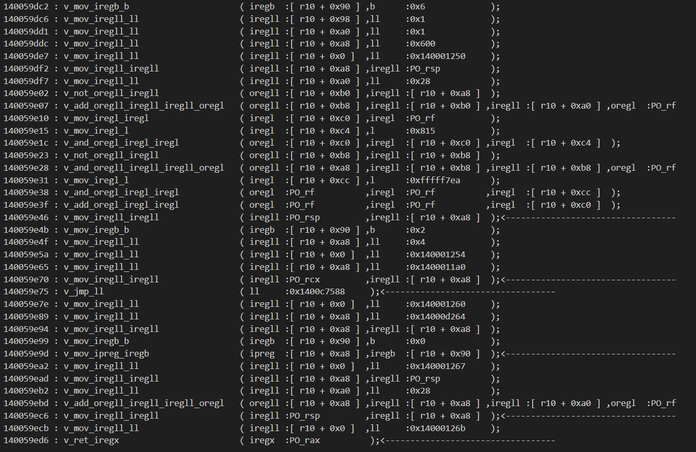
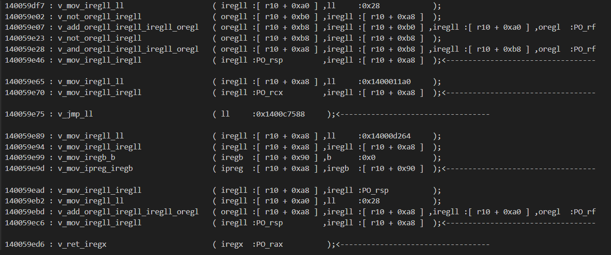

# 还原例子：

总所周知 ACE-BASE.sys 的DriverUnload函数是被vm了的，那么我们就用它来看看还原效果:


不错，很符合我对DriverUnload的想象。

左边 命名为 `icxxx` 的函数均为还原成功的函数。

# deTvm.py脚本玩法

请先给你的`idapython`安装以下的库:

```python
import capstone
import keystone
import copy
```

`main0`是对全部ida识别的函数进行特征分析，如果符合tvm函数特征，就对它进行还原。

可以算是一键还原全部tvm函数了，有可能有些tvm函数不符合特征，你也可以手动添加还原函数。

例如：

你知道一个函数`0x140001250`它是被vm的，那么你这么写，脚本就会自动特征识别V_RIP。

```python
testTrace = traceTask(0x140001250,tvm0base)  	#tvm0base是tvm0段的起始地址
testTrace.track(0)								#开始跟踪 得到traceCode
testTrace.traceOut()							#输出原始traceCode
```

如果你这个被vm的函数不符合我写的特征，但它确实是tvm的函数，那么可以这么写，自己设置V_RIP:

```python
#上一个例子的 函数 0x140001250 它的 V_RIP 就是 0x140059dc2
testTrace = traceTask(0,tvm0base)
testTrace.VStart = 0x140059dc2		#自己找这个vm函数的起始地址 例如V_RIP = 0x140059dc2 
testTrace.track(0)					#开始跟踪 得到traceCode
testTrace.traceOut()				#输出原始traceCode
```

traceOut(0)输出的结果如下:( 基本没做处理)



**如果想看 对标记working的traceCode进行变量溯源的结果，你可以这么写:**

```python
testTrace = traceTask(0x140001250,tvm0base)  	#tvm0base是tvm0段的起始地址
testTrace.track(0)								#开始跟踪 得到traceCode
testTrace.VRegRecord(True)						#如果是False就是不使用标记（上文说过）
testTrace.tvmToAsmAll.printAll()				#输出
```

输出：



**如果想进一步的进行变量传播优化还有 push、pop 优化，可以这么写:**

```python
testTrace = traceTask(0x140001250,tvm0base)  	#tvm0base是tvm0段的起始地址
testTrace.track(0)								#开始跟踪 得到traceCode
testTrace.VRegRecord(True)						#如果是False就是不使用标记（上文说过）
testTrace.tvmToAsmAll.optimizeAll()				#变量传播优化,push、pop优化
testTrace.tvmToAsmAll.printAll()				#输出
```

输出:


**如果想看还原成 ASM是什么样的，可以这样写:**

```python
testTrace = traceTask(0x140001250,tvm0base)  	#tvm0base是tvm0段的起始地址
testTrace.track(0)								#开始跟踪 得到traceCode
testTrace.VRegRecord(True)						#如果是False就是不使用标记（上文说过）
testTrace.tvmToAsmAll.optimizeAll()				#变量传播优化,push、pop优化
testTrace.tvmToAsmAll.AllTvmAsmToAsm() 			#转换成ASM  注意，一定要VRegRecord + optimizeAll 后才可以调用
testTrace.tvmToAsmAll.printAsmAll()				#输出ASM
```

输出:


**如果想看 tvmToAsm和Asm对应起来的输出，可以这样写:**

```python
testTrace = traceTask(0x140001250,tvm0base)  	#tvm0base是tvm0段的起始地址
testTrace.track(0)								#开始跟踪 得到traceCode
testTrace.VRegRecord(True)						#如果是False就是不使用标记（上文说过）
testTrace.tvmToAsmAll.optimizeAll()				#变量传播优化,push、pop优化
testTrace.tvmToAsmAll.AllTvmAsmToAsm() 			#转换成ASM

tvmToAsm_P = testTrace.tvmToAsmAll.tvmToAsmHead #结构为tvmToAsm
while (tvmToAsm_P != None):
    tvmToAsm_P.printAsm()                       #输出Asm
    tvmToAsm_P.print()                          #输出traceCodeAll
    print("")                                   #隔开
    tvmToAsm_P = tvmToAsm_P.BLink               #下一个
```

输出:


# TVMHandleTrace.py

去混淆跟踪 tvm函数入口到出口，未对输入函数做处理。所以跟踪有调用输入表函数的tvm函数会出错。


# TVMHandleOut.py

导出全部handle。